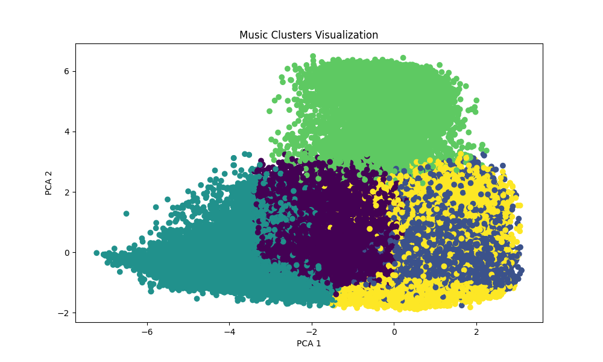
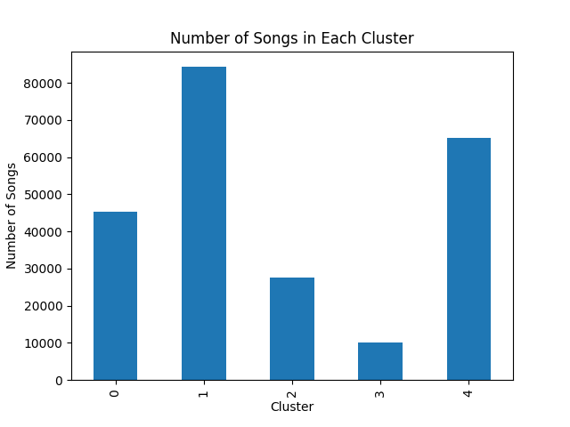

# Spotify Music Clustering & Recommendation System

## Project Overview

This project implements a machine learning based music recommendation system using Spotify song features. The system groups similar songs using clustering techniques and recommends songs that share similar audio characteristics. It also retrieves album posters using the Spotify API to make the recommendations visually identifiable.

## Dataset

The project uses a Spotify songs dataset containing approximately **232,000 songs**. Each song includes multiple audio features that describe the musical properties of the track.

**Key features used for clustering:**

* Danceability
* Energy
* Tempo
* Loudness
* Valence

These attributes help the model identify similarities between songs and group them into meaningful clusters.

## Methodology

The recommendation system follows the steps below:

1. Load and preprocess the Spotify dataset.
2. Select important musical features for clustering.
3. Normalize the data using feature scaling.
4. Apply **KMeans clustering** to group songs into clusters.
5. Evaluate cluster quality using **Silhouette Score**.
6. Reduce dimensionality using **PCA (Principal Component Analysis)** for visualization.
7. Recommend songs from the same cluster as the selected song.
8. Retrieve and display album posters using the Spotify Web API.

## Model Details

* **Algorithm Used:** KMeans Clustering
* **Number of Clusters:** 5
* **Evaluation Metric:** Silhouette Score
* **Dimensionality Reduction:** PCA (2D)

## Cluster Visualization

## Cluster Distribution

Example output summary:

Dataset size       : 232,725 songs
Features used      : danceability, energy, tempo, loudness, valence
Algorithm          : KMeans (K=5)
Silhouette Score   : ~0.24
PCA Variance (2D)  : ~73%

## Key Features of the Project

* Machine learning based music clustering
* Song recommendation based on audio similarity
* Album poster display using Spotify API
* Cluster analysis of large-scale music dataset
* Visualization using PCA

## Technologies Used

* Python
* Pandas
* NumPy
* Scikit-learn
* Matplotlib
* Spotipy (Spotify API)
* Google Colab

## How to Run the Project

1. Open the notebook in **Google Colab**.
2. Install the required libraries.
3. Run all cells in sequence.
4. Enter a song name to get similar song recommendations with album posters.

## Future Improvements

* Deploy the model as a web application.
* Integrate real-time Spotify user playlists.
* Improve clustering with advanced algorithms like DBSCAN or Hierarchical clustering.
* Add an interactive recommendation interface.

## Author

Design Project – Machine Learning Based Music Recommendation System
